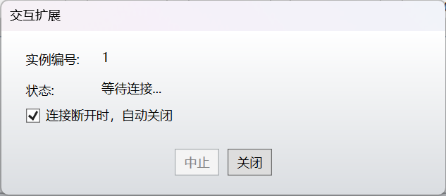

# zemax-python-connect

`zemax-python-connect` is a Codex/agent skill for establishing Python connections to Ansys Zemax OpticStudio through ZOS-API.

This package only handles connection setup and verification. It does not perform optical design, merit-function construction, optimization, MTF/spot analysis, or tolerancing strategy.

## What It Supports

- Standalone Application mode: Python starts its own OpticStudio API session through `CreateNewApplication()`.
- Interactive Extension mode: Python connects to the visible OpticStudio GUI through `ConnectAsExtension(instance)`.
- ZOS-API DLL discovery across different user machines.
- Basic connection diagnostics and safe visible GUI edit verification.

## Requirements

- Windows
- Ansys Zemax OpticStudio with ZOS-API support
- Python compatible with your OpticStudio/pythonnet setup
- `pythonnet`

Install dependency:

```powershell
pip install -r requirements.txt
```

## Step 1: Locate ZOS-API

Try automatic discovery:

```powershell
python scripts\zosapi_locator.py --list-candidates
```

If needed, pass your own OpticStudio path:

```powershell
python scripts\zosapi_locator.py --zemax-root "C:\Path\To\Ansys Zemax OpticStudio"
```

The path may be either:

- an OpticStudio install directory containing `ZOSAPI_NetHelper.dll`, `ZOSAPI.dll`, and `ZOSAPI_Interfaces.dll`; or
- a Zemax data directory containing `ZOS-API\Libraries\ZOSAPI_NetHelper.dll`.

## Mode A: Standalone Application

Use this mode for automation and file generation when you do not need to watch GUI changes in real time.

Run:

```powershell
python scripts\standalone_ping.py --zemax-root "C:\Path\To\Ansys Zemax OpticStudio"
```

Success looks like:

```text
MODE=StandaloneApplication
STATUS=OK
IS_VALID_LICENSE=True
HAS_PRIMARY_SYSTEM=True
```

Minimal example:

```powershell
python examples\standalone_minimal.py --zemax-root "C:\Path\To\Ansys Zemax OpticStudio"
```

## Mode B: Interactive Extension

Use this mode when you want Python to modify the OpticStudio window you are looking at.

### Required OpticStudio GUI Step

Open OpticStudio and click the independent Interactive Extension button in the `ZOS-API.NET` area:

```text
编程 > 交互扩展
Programming > Interactive Extension
```

You should see a waiting dialog like this:



The dialog should show an `Instance Number` and a waiting status. Keep it open while running Python.

Do not rely on only this menu:

```text
编程 > Python > 交互扩展
Programming > Python > Interactive Extension
```

That menu creates a Python template file. It does not by itself start the waiting connection dialog.

### Verify Connection

If the dialog shows instance `0`:

```powershell
python scripts\interactive_ping.py --zemax-root "C:\Path\To\Ansys Zemax OpticStudio" --instance 0
```

If the dialog shows instance `1`:

```powershell
python scripts\interactive_ping.py --zemax-root "C:\Path\To\Ansys Zemax OpticStudio" --instance 1
```

Success looks like:

```text
MODE=InteractiveExtension
STATUS=OK
APP_MODE=Plugin
IS_VALID_LICENSE=True
HAS_PRIMARY_SYSTEM=True
```

### Safe Visible Edit Test

After `interactive_ping.py` succeeds, run:

```powershell
python scripts\interactive_comment_test.py --zemax-root "C:\Path\To\Ansys Zemax OpticStudio" --instance 0
```

This changes Lens Data Editor comments only. It is a safe way to confirm that Python changes are visible in OpticStudio.

## About `--replace-current`

If a later program refuses to replace the visible OpticStudio system, save the original lens, click OpticStudio `ZOS-API.NET` area `交互扩展 / Interactive Extension` again, keep the waiting dialog open, then run the new program with `--replace-current` appended.

## Full Diagnostic Command

```powershell
python scripts\connection_diagnose.py --mode both --zemax-root "C:\Path\To\Ansys Zemax OpticStudio" --instance 0
```

This prints JSON with path discovery, license status, app mode, primary system status, and recommended next actions.

## Repository Layout

```text
zemax-python-connect/
  SKILL.md
  README.md
  requirements.txt
  scripts/
    zemax_connection.py
    zosapi_locator.py
    standalone_ping.py
    interactive_ping.py
    interactive_comment_test.py
    connection_diagnose.py
  examples/
    standalone_minimal.py
    interactive_minimal.py
  picture/
    README.md
  evals/
    evals.json
```

## Troubleshooting Summary

| Output | Meaning | Action |
|---|---|---|
| `STATUS=OK` | Connected correctly | Continue with the selected mode |
| `ZOSAPI_NetHelper.dll not found` | Wrong or undiscovered path | Pass `--zemax-root` |
| `ConnectAsExtension returned None` | Interactive dialog not open | Open independent `交互扩展 / Interactive Extension` dialog |
| `LICENSE=NotAuthorized` | API object not authorized | Reopen the correct Interactive Extension dialog or check license |
| Standalone shows `LICENSE=Unknown`, `Timeout`, or `NotAuthorized` after repeated attempts | Hidden/stale OpticStudio process or license state may be blocking API startup | Close hidden OpticStudio processes or restart OpticStudio, then rerun `standalone_ping.py` |
| `APP_MODE=Server` during interactive check | Not connected to plugin session | Restart Interactive Extension from `ZOS-API.NET` area |
| `PrimarySystem is None` | No open/valid optical system | Open or create a lens in OpticStudio |
